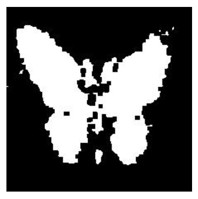

# AIL721 Assignment 2: ResNet and Guided Backpropagation

This repository contains my submission for Assignment 2 of the AIL721: Deep Learning under Prof. James Arambam. The assignment involved implementing a ResNet architecture from scratch for image classification and subsequently utilizing gradient-based methods to perform image segmentation as a "free lunch" task.

## Part 1: ResNet Implementation for Image Classification

### Architecture

A Residual Network (ResNet) was implemented following the specifications outlined in the assignment:

1.  **Input Layer:** A 3x3 Convolutional layer processing the 224x224x3 input image, outputting 32 feature maps. Followed by BatchNorm and ReLU.
2.  **Residual Blocks (n=2):**
    *   **Stage 1:** `n=2` Residual Blocks operating on 32 channels (feature map size 224x224).
    *   **Stage 2:** A 3x3 Convolutional layer with stride 2 for downsampling (32 -> 64 channels), followed by `n=2` Residual Blocks operating on 64 channels (feature map size 112x112).
    *   **Stage 3:** A 3x3 Convolutional layer with stride 2 for downsampling (64 -> 128 channels), followed by `n=2` Residual Blocks operating on 128 channels (feature map size 56x56).
3.  **Output Layer:**
    *   Adaptive Average Pooling is applied to the output of the last residual block stage to get a 128-dimensional feature vector per image.
    *   A Fully Connected (Linear) layer maps the 128 features to `r` classes (where `r=100` for the given dataset).

Each Residual Block consists of two 3x3 Convolutional layers, each followed by BatchNorm and ReLU. A skip connection adds the input of the block to the output of the second convolutional layer before the final ReLU activation. Appropriate padding (`padding='same'` or `padding=1` for stride 2 convs) is used to maintain feature map sizes or handle downsampling as described.

The total number of convolutional/FC layers follows the 6n+2 formula (1 initial conv + 3 stages * (2 convs per block * n blocks) + 1 FC layer = 1 + 3*(2*2) + 1 = 14 layers, matching 6n+2 for n=2).

### Training (`train.py`)

The `train.py` script:
1.  Takes the path to the training data directory and the desired model checkpoint directory as input.
2.  Defines the ResNet architecture described above with `n=2` and `r=100`.
3.  Uses `torchvision.datasets.ImageFolder` to load the training data.
4.  Determines the number of epochs dynamically based on the time taken for the first epoch, aiming to train for roughly 80% of the estimated epochs possible within a 1-hour time limit.
5.  Trains the model using Adam optimizer and Cross-Entropy Loss.
6.  Saves the trained model's state dictionary to `resnet_model.pth` in the specified checkpoint directory.
7.  Saves the mapping from class indices to class names in `class_names.json`.

## Part 2: Image Segmentation using Guided Backpropagation Principles

### Concept ("Free Lunch")

This part leverages the trained classification model to perform segmentation without any specific segmentation training. The hypothesis is that the classifier must learn to focus on the relevant object (foreground) to make accurate predictions, and this spatial focus can be extracted.

**Implementation (`evaluate.py`):**

The `evaluate.py` script:
1.  Loads the trained ResNet model (`resnet_model.pth`) and class names (`class_names.json`).
2.  Takes the model path and the test images directory as input.
3.  For each test image:
    *   Performs inference to get the predicted class \(c\).
    *   Sets `requires_grad=True` for the input image tensor.
    *   Performs a forward pass to get the scores.
    *   Selects the score \(S_c\) for the predicted class.
    *   Calls `backward()` on \(S_c\) to compute the gradient \(G = \frac{\partial S_c}{\partial I}\).
    *   Processes the gradient tensor \(G\):
        *   Takes the maximum value across the color channels for each pixel position: \(G'_{xy} = \max_{channel}(|G_{channel, xy}|)\) (The code uses `np.max(grads, axis=0)` which takes the max across channels, effectively focusing on the channel with the strongest signal).
        *   Calculates a threshold value (80th percentile of the gradient magnitudes \(G'\)).
        *   Creates a binary mask where pixels with gradient magnitude above the threshold are set to 1 (foreground), others to 0 (background).
        *   Applies a 5x5 Max Pooling operation to the binary mask. This acts as a morphological dilation, slightly enlarging and smoothing the segmented regions.
    *   Saves the final binary mask (scaled to 0-255) as a PNG image in the `seg_maps/` directory.
    *   Appends the image name and predicted class label to a list.
4.  Writes the classification predictions to `submission.csv`.

## Example Result

